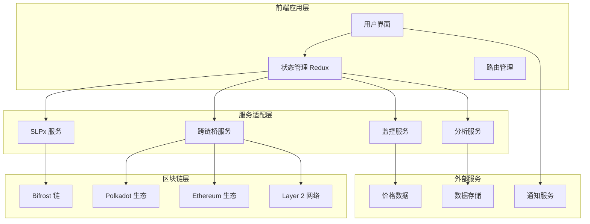
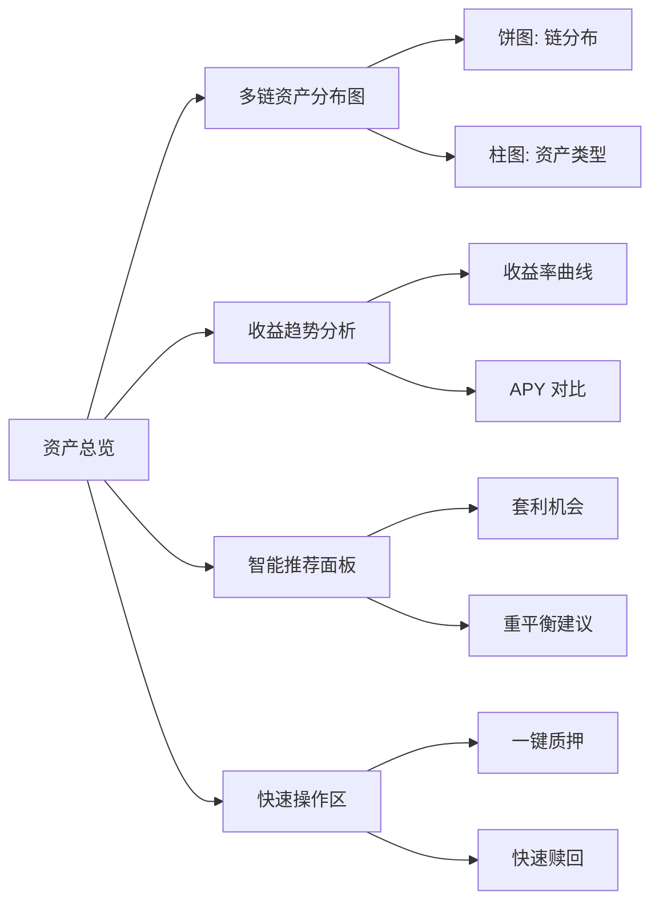
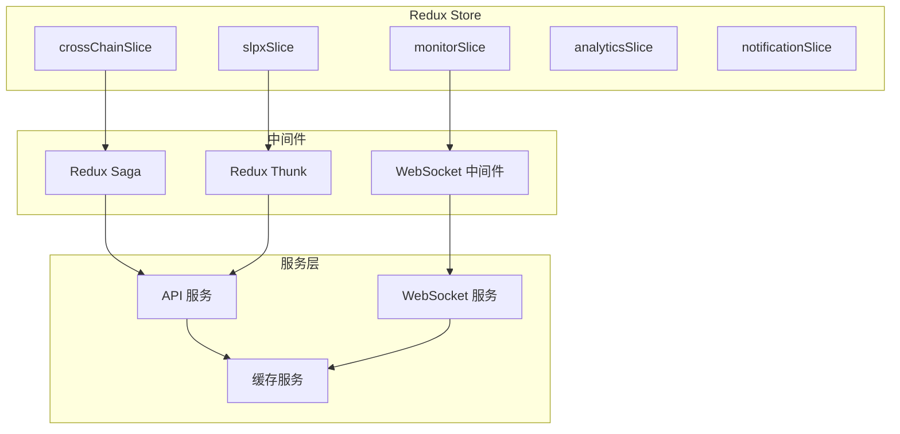
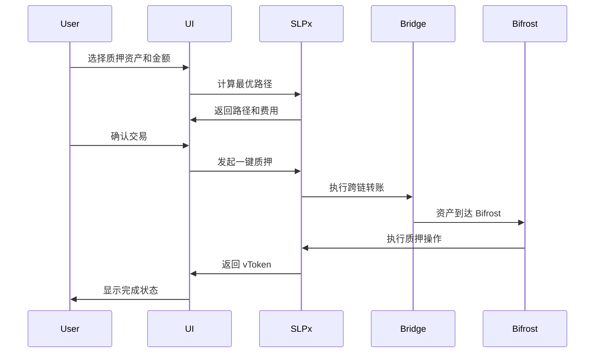

# FrostyFlow Bifrost 增强设计文档

## 1. 系统架构设计

### 1.1 整体架构



### 1.2 核心模块设计

#### 跨链桥接模块 (CrossChainBridge)
- **功能**: 处理不同区块链之间的资产转移
- **支持协议**: Snowbridge (Polkadot-Ethereum), Hyperbridge (多链)
- **状态管理**: 交易状态追踪和进度更新

#### SLPx 集成模块 (SLPxIntegration)
- **功能**: 一键跨链质押，简化用户操作流程
- **智能路由**: 自动选择最优的跨链路径
- **费用优化**: 实时计算和比较不同路径的费用

#### 多链监控模块 (MultiChainMonitor)
- **功能**: 实时监控多链资产状态和价格变化
- **数据聚合**: 统一展示不同链上的资产信息
- **异常检测**: 监控异常交易和价格波动

## 2. 用户界面设计

### 2.1 主要页面重构

#### 资产总览页面增强


#### 跨链操作页面
- **源链选择**: 支持的所有网络列表
- **目标链选择**: 根据资产类型智能筛选
- **路径优化**: 显示多种跨链路径和费用对比
- **进度追踪**: 实时显示跨链交易状态

#### 高级分析页面
- **投资组合分析**: 资产配置优化建议
- **收益分析**: 历史收益和预期收益对比
- **风险评估**: 投资风险等级和建议
- **市场洞察**: 市场趋势和机会分析

### 2.2 组件设计

#### 实时状态追踪组件
```typescript
interface TransactionStatus {
  id: string;
  type: 'stake' | 'redeem' | 'bridge';
  status: 'pending' | 'processing' | 'completed' | 'failed';
  progress: number;
  estimatedTime: number;
  steps: TransactionStep[];
}

interface TransactionStep {
  name: string;
  status: 'pending' | 'active' | 'completed' | 'failed';
  timestamp?: number;
  txHash?: string;
}
```

#### 多链资产展示组件
```typescript
interface MultiChainAsset {
  symbol: string;
  totalBalance: number;
  totalValue: number;
  distributions: ChainDistribution[];
  apy: number;
  priceChange24h: number;
}

interface ChainDistribution {
  chainId: string;
  chainName: string;
  balance: number;
  value: number;
  percentage: number;
}
```

## 3. 数据流设计

### 3.1 状态管理架构



### 3.2 实时数据流

#### WebSocket 连接管理
- **价格数据**: 实时价格和汇率更新
- **交易状态**: 跨链和质押交易状态变化
- **余额更新**: 多链余额实时同步
- **通知推送**: 重要事件和提醒

#### 数据缓存策略
- **本地缓存**: 用户偏好和历史数据
- **内存缓存**: 频繁访问的价格和余额数据
- **持久化缓存**: 交易历史和分析数据

## 4. 核心功能实现

### 4.1 SLPx 一键质押流程



### 4.2 多链资产监控

#### 数据聚合逻辑
```typescript
class MultiChainAssetAggregator {
  async aggregateAssets(walletAddress: string): Promise<MultiChainAsset[]> {
    const chains = await this.getSupportedChains();
    const assetPromises = chains.map(chain => 
      this.getChainAssets(chain.id, walletAddress)
    );
    
    const chainAssets = await Promise.all(assetPromises);
    return this.mergeAssetsBySymbol(chainAssets);
  }
  
  private mergeAssetsBySymbol(chainAssets: ChainAsset[][]): MultiChainAsset[] {
    const assetMap = new Map<string, MultiChainAsset>();
    
    chainAssets.flat().forEach(asset => {
      const existing = assetMap.get(asset.symbol);
      if (existing) {
        existing.distributions.push({
          chainId: asset.chainId,
          chainName: asset.chainName,
          balance: asset.balance,
          value: asset.value,
          percentage: 0 // 计算后更新
        });
        existing.totalBalance += asset.balance;
        existing.totalValue += asset.value;
      } else {
        assetMap.set(asset.symbol, this.createMultiChainAsset(asset));
      }
    });
    
    return Array.from(assetMap.values()).map(this.calculatePercentages);
  }
}
```

### 4.3 智能推荐系统

#### 推荐算法设计
```typescript
interface RecommendationEngine {
  analyzeUserProfile(walletAddress: string): Promise<UserProfile>;
  findArbitrageOpportunities(): Promise<ArbitrageOpportunity[]>;
  suggestRebalancing(portfolio: Portfolio): Promise<RebalanceStrategy>;
  recommendNewStaking(userProfile: UserProfile): Promise<StakingRecommendation[]>;
}

interface UserProfile {
  riskTolerance: 'conservative' | 'moderate' | 'aggressive';
  preferredChains: string[];
  averageStakingAmount: number;
  stakingHistory: StakingRecord[];
  profitLossRatio: number;
}
```

## 5. 技术实现细节

### 5.1 跨链桥接实现

#### Snowbridge 集成
```typescript
class SnowbridgeService {
  async bridgeToEthereum(
    asset: string,
    amount: number,
    recipient: string
  ): Promise<BridgeTransaction> {
    const bridgeContract = await this.getSnowbridgeContract();
    const tx = await bridgeContract.lock(asset, amount, recipient);
    
    return {
      txHash: tx.hash,
      status: 'pending',
      estimatedTime: 600, // 10 minutes
      steps: this.createBridgeSteps()
    };
  }
  
  async trackBridgeProgress(txHash: string): Promise<BridgeStatus> {
    // 监控桥接进度
    const polkadotStatus = await this.checkPolkadotStatus(txHash);
    const ethereumStatus = await this.checkEthereumStatus(txHash);
    
    return this.calculateOverallStatus(polkadotStatus, ethereumStatus);
  }
}
```

#### Hyperbridge 集成
```typescript
class HyperbridgeService {
  async bridgeToL2(
    sourceChain: string,
    targetChain: string,
    asset: string,
    amount: number
  ): Promise<BridgeTransaction> {
    const route = await this.findOptimalRoute(sourceChain, targetChain);
    const bridgeTx = await this.executeBridge(route, asset, amount);
    
    return this.trackTransaction(bridgeTx);
  }
}
```

### 5.2 实时数据更新

#### WebSocket 事件处理
```typescript
class RealtimeDataService {
  private ws: WebSocket;
  private eventHandlers: Map<string, Function[]> = new Map();
  
  connect() {
    this.ws = new WebSocket(WS_ENDPOINT);
    
    this.ws.onmessage = (event) => {
      const data = JSON.parse(event.data);
      this.handleEvent(data.type, data.payload);
    };
  }
  
  subscribe(eventType: string, handler: Function) {
    if (!this.eventHandlers.has(eventType)) {
      this.eventHandlers.set(eventType, []);
    }
    this.eventHandlers.get(eventType)!.push(handler);
  }
  
  private handleEvent(type: string, payload: any) {
    const handlers = this.eventHandlers.get(type) || [];
    handlers.forEach(handler => handler(payload));
  }
}
```

## 6. 性能优化

### 6.1 前端优化
- **代码分割**: 按路由和功能模块分割代码
- **懒加载**: 图表和重型组件懒加载
- **虚拟滚动**: 大量数据列表使用虚拟滚动
- **缓存策略**: 智能缓存用户数据和价格信息

### 6.2 数据优化
- **批量请求**: 合并多个API请求
- **增量更新**: 只更新变化的数据
- **压缩传输**: 使用gzip压缩数据传输
- **CDN加速**: 静态资源使用CDN分发

## 7. 安全设计

### 7.1 交易安全
- **交易确认**: 重要操作需要用户明确确认
- **金额验证**: 客户端和服务端双重验证
- **超时机制**: 交易超时自动取消
- **错误恢复**: 失败交易的恢复机制

### 7.2 数据安全
- **加密存储**: 敏感数据本地加密存储
- **安全传输**: 所有API调用使用HTTPS
- **访问控制**: 基于钱包地址的访问控制
- **审计日志**: 记录所有重要操作

## 8. 监控和分析

### 8.1 用户行为分析
- **操作统计**: 用户操作频率和成功率
- **路径分析**: 用户使用路径和偏好
- **性能监控**: 页面加载时间和响应速度
- **错误追踪**: 错误发生频率和类型

### 8.2 业务指标监控
- **交易量统计**: 各类交易的数量和金额
- **用户增长**: 新用户注册和活跃度
- **收益分析**: 平台和用户收益情况
- **市场分析**: 市场趋势和机会识别