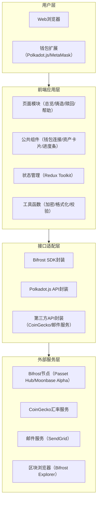
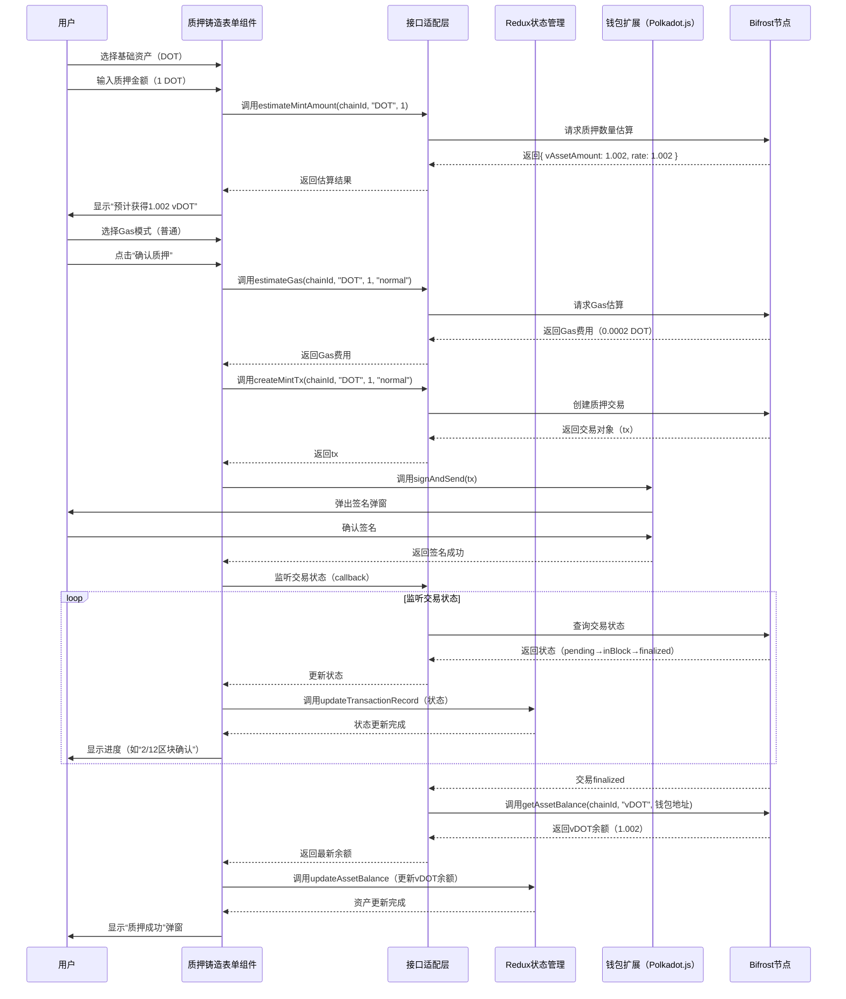

# FrostyFlow项目设计文档集
本文档集基于“Bifrost多链流动性质押一站式交互平台”需求，细化输出**功能需求文档**、**系统设计文档**、**详细设计文档**，为后续开发提供完整技术依据。


# 一、功能需求文档（FRD）
## 1. 文档基础信息
| 项目 | 内容 |
|------|------|
| 文档版本 | V1.0 |
| 适用阶段 | 开发阶段（10.14-10.27） |
| 核心目标 | 定义FrostyFlow所有功能点的“用户操作-系统响应-业务规则”，确保开发与需求一致 |


## 2. 功能模块划分
基于用户旅程，将项目拆解为5大核心模块，模块间逻辑关系如下：  
`钱包连接（入口）→ 资产总览（核心视图）→ 质押铸造/赎回（核心操作）→ 帮助中心（辅助支持）→ 系统设置（个性化配置）`


## 3. 详细功能需求
### 3.1 模块1：钱包连接与链管理（入口模块）
#### 3.1.1 功能1：钱包类型选择
| 需求项 | 详细描述 |
|--------|----------|
| 功能描述 | 用户打开应用后，可选择兼容的钱包类型，触发钱包连接流程 |
| 前置条件 | 应用加载完成，用户未连接钱包 |
| 后置条件 | 钱包选择后，触发对应钱包的授权弹窗 |
| 支持钱包类型 | 1. Polkadot.js（优先支持，适配Passet Hub链）；2. MetaMask（适配Moonbase Alpha链）；3. Talisman（兼容Polkadot生态多链） |
| 交互逻辑 | - 页面居中显示“选择钱包”弹窗，3种钱包以“图标+名称”卡片形式排列；<br>- 鼠标悬浮钱包卡片时，显示“支持链：Passet Hub/Moonbase Alpha”提示；<br>- 点击卡片后，若钱包未安装（如Chrome未装Polkadot.js扩展），弹窗提示“请先安装[钱包名称]扩展，点击下载”（附官方下载链接） |
| 异常场景 | - 场景1：钱包已安装但未启用 → 提示“请在浏览器扩展中启用[钱包名称]，启用后刷新页面”；<br>- 场景2：点击卡片后3秒内无钱包响应 → 提示“钱包连接超时，请重试或切换其他钱包” |

#### 3.1.2 功能2：多链自动识别与切换
| 需求项 | 详细描述 |
|--------|----------|
| 功能描述 | 钱包连接后，自动识别已添加的Bifrost兼容链；支持用户手动切换链或添加新链 |
| 前置条件 | 钱包连接成功，获取用户钱包内已添加的链列表 |
| 后置条件 | 链切换/添加后，页面实时加载对应链的质押资产数据 |
| 核心交互 | 1. **链识别**：连接后1秒内，在顶部导航栏“链选择”下拉框中显示“已添加链”（如“Bifrost Passet Hub”“Moonbase Alpha”），未兼容链（如Ethereum主网）标注“不支持”并置灰；<br>2. **链切换**：下拉选择目标链后，页面无刷新更新（通过React状态管理切换链ID），同时显示“切换至[链名称]中...”加载动画（≤1秒）；<br>3. **链添加**：下拉框底部显示“+ 添加Bifrost兼容链”按钮，点击后弹出“链配置”弹窗（预置Passet Hub/Moonbase Alpha的官方配置：链ID、RPC节点、图标、区块浏览器链接），用户点击“一键添加”即可完成链配置 |
| 业务规则 | - 链切换时，若用户当前有未完成的交易（如铸造中），弹窗提示“当前有交易待确认，确认切换链将终止当前交易，是否继续？”（提供“继续切换”“取消”按钮）；<br>- 链添加后，自动将该链设为当前活跃链，并更新资产数据 |
| 异常场景 | - 场景1：添加链时RPC节点不可用 → 提示“当前链RPC节点异常，请稍后重试（节点地址：[RPC地址]）”；<br>- 场景2：切换链后获取资产数据失败 → 显示“链数据加载失败，点击刷新”按钮（点击后重新调用Bifrost SDK接口） |


### 3.2 模块2：多链资产总览（核心视图模块）
#### 3.2.1 功能1：资产总览统计
| 需求项 | 详细描述 |
|--------|----------|
| 功能描述 | 展示用户在所有兼容链的Bifrost流动性质押资产“总价值+总收益”，提供宏观资产视角 |
| 前置条件 | 钱包连接成功，至少已加载1条链的资产数据 |
| 数据来源 | 1. 链上资产数据：通过Bifrost SDK `getAssetBalance(chainId, assetId)` 获取各链流动性质押代币余额；<br>2. 汇率数据：通过CoinGecko API `https://api.coingecko.com/api/v3/simple/price?ids=[资产ID]&vs_currencies=usd` 获取实时USD汇率（如DOT→USD、vDOT→USD） |
| 交互逻辑 | - 页面顶部显示2个核心指标卡片：<br>  ① 总资产价值：`Σ（各链流动性质押代币余额 × 对应USD汇率）`，单位USD，保留2位小数，右侧显示“24h变动”（红色↓/绿色↑+百分比）；<br>  ② 累计收益：`Σ（各链流动性质押代币余额 - 历史质押基础资产折算量）× USD汇率`，单位USD，下方标注“收益计算基于质押记录，实时更新”；<br>- 指标卡片支持点击“刷新”图标（右上角），手动触发数据更新（更新时显示加载动画，≤2秒） |
| 业务规则 | - 若某条链数据加载失败，该链资产不计入总统计，卡片下方显示“[链名称]数据加载失败，已排除该链资产”提示；<br>- 汇率数据每5分钟自动更新1次，用户手动刷新时实时更新 |

#### 3.2.2 功能2：链维度资产卡片
| 需求项 | 详细描述 |
|--------|----------|
| 功能描述 | 按“链”分组展示用户在各链的质押资产明细，支持点击进入单链资产详情页 |
| 前置条件 | 资产总览数据加载完成 |
| 卡片元素与交互 | 每个链对应1张卡片，包含以下元素：<br>1. 链标识：左上角显示链图标+链名称（如“Bifrost Passet Hub”）；<br>2. 资产列表：显示该链下用户持有的所有Bifrost流动性质押资产（如vDOT、vKSM），每项资产显示“资产图标+名称（如vDOT）+余额（如1.234 vDOT）+折合USD（如$15.62）”；<br>3. 链收益：卡片底部显示“该链累计收益：$3.21”，右侧标注“年化收益：4.5%”（年化收益通过Bifrost SDK `getAPY(chainId, assetId)` 获取）；<br>4. 操作按钮：卡片右下角显示“查看详情”按钮，点击跳转至“单链资产详情页” |
| 异常场景 | - 场景1：某链无质押资产 → 卡片显示“暂无[链名称]质押资产，点击‘去质押’开始”（“去质押”按钮跳转至铸造页面）；<br>- 场景2：资产余额更新延迟 → 卡片右上角显示“数据更新于1分钟前”，支持点击“刷新”同步最新数据 |


### 3.3 模块3：质押铸造（核心操作模块）
#### 3.3.1 功能1：质押资产选择
| 需求项 | 详细描述 |
|--------|----------|
| 功能描述 | 用户选择当前链下可质押的基础资产（如DOT），系统展示该资产的质押规则与参数 |
| 前置条件 | 已切换至目标链（如Passet Hub），钱包连接成功 |
| 交互逻辑 | 1. 页面顶部显示“选择质押资产”下拉框，选项为当前链支持的基础资产（如“DOT（Polkadot）”“KSM（Kusama）”），每个选项标注“支持流动性质押代币：vDOT”；<br>2. 选择资产后，页面下方显示“资产详情”面板：<br>   - 资产介绍：“DOT：Polkadot原生代币，质押后生成vDOT（Bifrost流动性质押代币），可自由参与DeFi挖矿/交易”；<br>   - 质押规则：“最小质押量：0.1 DOT | 质押费率：0% | 赎回周期：标准赎回7天，即时赎回支持（手续费0.5%）”；<br>   - 实时汇率：“当前1 DOT = 1.002 vDOT（基于Bifrost质押池余额计算）” |
| 业务规则 | - 若当前链无支持的质押资产 → 页面显示“[链名称]暂不支持质押，建议切换至Bifrost Passet Hub或Moonbase Alpha”；<br>- 资产选择后，页面默认保存该选择（localStorage存储），下次进入铸造页面自动选中上次资产 |

#### 3.3.2 功能2：质押金额输入与校验
| 需求项 | 详细描述 |
|--------|----------|
| 功能描述 | 用户输入质押金额，系统实时校验合法性并计算预计获得的流动性质押代币数量 |
| 前置条件 | 已选择质押资产 |
| 交互逻辑 | 1. 金额输入框：<br>   - 支持手动输入数字（保留6位小数，超出自动截断）；<br>   - 右侧显示“最大”按钮，点击自动填充钱包内该基础资产的可用余额（扣除10%Gas预留，如可用10 DOT则填充9 DOT）；<br>2. 实时计算：输入金额后，下方显示“预计获得vDOT：X.XXXX”（计算公式：`输入金额 × 实时汇率`，汇率通过Bifrost SDK获取）；<br>3. 合法性校验：<br>   - 输入为0或负数 → 提示“请输入大于0的金额”；<br>   - 输入超过可用余额 → 提示“余额不足，当前可用：Y.XXXX DOT”，输入框边框标红；<br>   - 输入小于最小质押量 → 提示“最小质押量为0.1 DOT，请调整金额” |
| 业务规则 | - 金额输入后，若5分钟内未提交交易，页面弹窗提示“汇率可能已更新，是否重新计算？”（点击“是”重新获取汇率并更新预计数量）；<br>- 输入框支持粘贴金额（粘贴非数字内容时自动清空并提示“请输入有效数字”） |

#### 3.3.3 功能3：Gas配置与交易提交
| 需求项 | 详细描述 |
|--------|----------|
| 功能描述 | 用户选择Gas模式，提交质押交易并实时跟踪链上确认进度 |
| 前置条件 | 金额输入合法，用户已确认预计获得的流动性质押代币数量 |
| 交互逻辑 | 1. Gas模式选择：<br>   - 提供3种模式：<br>     ① 快速确认（高Gas）：“预计30秒内确认，Gas费用：0.0005 DOT”；<br>     ② 普通确认（中Gas）：“预计2分钟内确认，Gas费用：0.0002 DOT”；<br>     ③ 经济确认（低Gas）：“预计5分钟内确认，Gas费用：0.0001 DOT”；<br>   - 默认选中“普通确认”，Gas费用通过Polkadot.js API `estimateGas(tx)` 实时计算；<br>2. 交易提交：<br>   - 点击“确认质押”按钮后，触发钱包签名弹窗（显示交易详情：资产类型、金额、Gas费用）；<br>   - 签名成功后，页面跳转至“交易进度页”，显示：<br>     - 交易哈希：“0x...（点击查看区块浏览器）”；<br>     - 确认进度：“区块确认中（2/12）”（实时更新确认区块数）；<br>     - 预计时间：“预计剩余1分30秒”；<br>3. 结果反馈：<br>   - 确认完成（12/12区块）：弹窗提示“质押成功！已获得X.XXXX vDOT”，提供“查看资产”（跳转至总览页）、“继续质押”（返回铸造页）按钮；<br>   - 交易失败：提示“质押失败：[失败原因，如Gas不足/链节点异常]”，提供“重试”“联系支持”按钮 |
| 业务规则 | - 交易提交后，若钱包断开连接 → 进度页显示“钱包已断开，交易仍在链上处理，可重新连接钱包查看结果”；<br>- 交易失败后，系统自动清除本次输入的金额与Gas配置，避免重复提交 |


### 3.4 模块4：质押赎回（核心操作模块）
#### 3.4.1 功能1：赎回类型选择
| 需求项 | 详细描述 |
|--------|----------|
| 功能描述 | 用户选择“即时赎回”或“标准赎回”，系统展示两种类型的规则差异 |
| 前置条件 | 已切换至目标链，且该链有可赎回的流动性质押资产（如vDOT） |
| 交互逻辑 | 1. 赎回类型选项：<br>   - 两个选项卡片并排显示，包含“类型名称+图标+核心规则”：<br>     ① 即时赎回：“图标→闪电”，规则：“10分钟内到账，手续费0.5%，支持部分链”；<br>     ② 标准赎回：“图标→时钟”，规则：“7天解锁期，0手续费，全链支持”；<br>   - 若当前链不支持即时赎回（如Moonbase Alpha测试网），即时赎回卡片置灰并标注“当前链暂不支持”；<br>2. 规则详情：选择类型后，下方显示“详情说明”（如标准赎回：“解锁期从提交赎回申请开始计算，到期后基础资产自动发放至钱包，期间不产生收益”） |
| 业务规则 | - 赎回类型选择后，页面保存该选择（sessionStorage存储），刷新页面不丢失；<br>- 若用户持有的流动性质押代币仅支持一种赎回类型（如测试网仅支持标准赎回），自动选中该类型并隐藏另一种选项 |

#### 3.4.2 功能2：赎回进度追踪
| 需求项 | 详细描述 |
|--------|----------|
| 功能描述 | 用户提交赎回申请后，可实时查看赎回状态（如“解锁中”“已到账”），接收到期提醒 |
| 前置条件 | 赎回申请提交成功 |
| 交互逻辑 | 1. 赎回列表：在“单链资产详情页”新增“赎回记录” tab，显示所有未完成/已完成的赎回申请，每条记录包含：<br>   - 基本信息：“赎回类型（标准）| 赎回资产：vDOT | 金额：1.23 DOT | 申请时间：2025-10-20 14:30”；<br>   - 状态标签：<br>     - 解锁中：橙色标签，显示“剩余解锁时间：5天3小时”（实时倒计时）；<br>     - 已到账：绿色标签，显示“到账时间：2025-10-27 14:30”；<br>     - 失败：红色标签，显示“失败原因：链节点异常，可重新申请”；<br>2. 到期提醒：<br>   - 标准赎回到期前24小时，发送站内通知（页面右上角铃铛图标小红点）；<br>   - 到账后，发送站内通知+邮件通知（若用户开启邮件提醒），通知内容：“您的1.23 DOT赎回已到账，可在钱包中查看” |
| 业务规则 | - 赎回记录永久保存（本地存储+链上查询），支持按“状态（解锁中/已到账）”筛选；<br>- 若赎回到期后资产未到账，记录显示“到账异常”，提供“重试到账”按钮（调用Bifrost SDK `claimRedeem(chainId, redeemId)` 接口） |


### 3.5 模块5：帮助中心与系统设置（辅助模块）
#### 3.5.1 功能1：FAQ与搜索
| 需求项 | 详细描述 |
|--------|----------|
| 功能描述 | 提供分类FAQ，支持关键词搜索，解决用户常见问题 |
| 前置条件 | 应用任意页面（帮助中心入口在页面右下角“问号”浮窗） |
| 交互逻辑 | 1. 浮窗入口：右下角常驻“问号”图标，点击展开帮助面板（宽度300px，高度500px，可拖动）；<br>2. 分类FAQ：面板顶部按“问题类型”分类（钱包连接、质押流程、赎回规则、资产查询），点击分类显示对应问题列表（如“钱包连接”分类下：“如何安装Polkadot.js扩展？”“钱包连接失败怎么办？”）；<br>3. 关键词搜索：面板顶部有搜索框，输入关键词（如“质押最小金额”），实时筛选问题列表（高亮匹配关键词）；<br>4. 问题详情：点击问题，下方展开答案（含图文说明，如“钱包连接步骤：1. 点击‘连接钱包’→2. 选择Polkadot.js→3. 在扩展中授权”） |
| 业务规则 | - FAQ答案包含“官方链接”（如Bifrost文档、钱包下载链接），点击跳转至新标签页；<br>- 若搜索无结果，显示“未找到相关问题，可通过X平台@FrostyLst咨询” |

#### 3.5.2 功能2：通知设置
| 需求项 | 详细描述 |
|--------|----------|
| 功能描述 | 用户可开启/关闭不同类型的通知（站内、邮件），管理通知偏好 |
| 前置条件 | 钱包连接成功（设置页面入口在顶部导航栏“用户头像”下拉框→“系统设置”） |
| 交互逻辑 | 1. 通知类型开关：<br>   - 站内通知：默认开启（不可关闭，核心功能）；<br>   - 邮件通知：默认关闭，开启需输入邮箱并验证（发送验证码邮件，输入验证码后生效）；<br>2. 通知细分设置：<br>   - 质押成功通知：开启/关闭；<br>   - 赎回到期通知：开启/关闭；<br>   - 资产到账通知：开启/关闭；<br>3. 通知记录：页面下方显示“最近10条通知”，支持“标记全部已读”“删除通知” |
| 业务规则 | - 邮箱验证有效期15分钟，过期需重新发送；<br>- 关闭某类通知后，该类事件不再触发对应通知（如关闭“赎回到期通知”，到期后仅发送站内通知） |


# 二、系统设计文档（SDD）
## 1. 文档基础信息
| 项目 | 内容 |
|------|------|
| 文档版本 | V1.0 |
| 设计目标 | 定义系统架构、技术栈、模块交互、接口与数据模型，支撑开发落地 |
| 适用角色 | 前端开发、测试工程师、技术负责人 |


## 2. 总体架构设计
采用**分层架构**设计，自上而下分为4层，层间通过接口解耦，确保可扩展性：



### 2.1 分层职责说明
| 层级 | 核心职责 | 设计原则 |
|------|----------|----------|
| 用户层 | 提供用户交互入口（浏览器+钱包扩展） | 兼容主流浏览器（Chrome/Firefox/Edge），支持Web3钱包标准协议 |
| 前端应用层 | 实现页面渲染、用户交互、状态管理 | 组件化（高复用）、状态集中管理（可追溯）、工具函数原子化 |
| 接口适配层 | 封装外部服务接口，统一输入输出格式 | 解耦（前端不直接依赖外部SDK/API）、容错（统一异常处理） |
| 外部服务层 | 提供链上数据、汇率、通知等基础服务 | 优先使用官方服务（如Bifrost官方节点），确保数据可靠性 |


## 3. 技术架构设计
### 3.1 技术栈选型（详细版本）
| 技术类别 | 选型 | 版本 | 用途 |
|----------|------|------|------|
| 前端框架 | React | 18.2.0 | 页面组件开发，支持并发渲染（优化多链数据加载） |
| UI组件库 | Ant Design | 5.16.1 | 快速搭建页面（表单、弹窗、卡片等基础组件） |
| 状态管理 | Redux Toolkit | 2.2.3 | 管理全局状态（用户资产、链信息、交易状态） |
| 多链交互 | Polkadot.js API | 12.6.2 | 与Polkadot生态链节点交互（签名、交易发送） |
| Bifrost适配 | Bifrost SDK | 1.8.0 | 调用Bifrost流动性质押核心接口（铸造/赎回/APY查询） |
| 图表可视化 | ECharts | 5.4.3 | 绘制资产收益趋势图（单链资产详情页） |
| 路由管理 | React Router | 6.22.3 | 管理页面路由（总览→铸造→赎回→详情） |
| 接口请求 | Axios | 1.6.8 | 调用第三方API（CoinGecko/邮件服务） |
| 邮件服务 | SendGrid SDK | 8.1.3 | 发送赎回到期、资产到账邮件通知 |
| 部署工具 | Vercel | 最新版 | 前端应用部署（支持测试网/主网环境切换） |
| 代码管理 | GitHub | 最新版 | 代码托管（开源，MIT协议） |
| 错误监控 | Sentry | 7.114.0 | 捕获前端错误（如接口调用失败、组件渲染异常） |

### 3.2 环境配置
分为**测试网环境**与**主网环境**，通过环境变量区分：

| 环境变量 | 测试网（.env.test） | 主网（.env.prod） |
|----------|---------------------|-------------------|
| REACT_APP_BIFROST_PASSET_HUB_RPC | wss://rpc.testnet.bifrost-para.liebi.com/ws | wss://rpc.bifrost-para.liebi.com/ws |
| REACT_APP_MOONBASE_ALPHA_RPC | wss://moonbase-alpha.public.blastapi.io | wss://moonbeam.api.onfinality.io/public-ws |
| REACT_APP_COINGECKO_API_URL | https://api.coingecko.com/api/v3 | https://api.coingecko.com/api/v3 |
| REACT_APP_SENDGRID_API_KEY | 测试网API密钥（免费额度） | 主网API密钥 |
| REACT_APP_SENTRY_DSN | 测试网Sentry DSN | 主网Sentry DSN |


## 4. 模块交互设计
### 4.1 核心模块依赖关系
```mermaid
graph LR
    钱包连接模块 --> 资产总览模块（提供链ID/钱包地址）
    资产总览模块 --> 质押铸造模块（提供当前链/资产信息）
    资产总览模块 --> 质押赎回模块（提供可赎回资产列表）
    质押铸造模块 --> 状态管理（更新资产/交易状态）
    质押赎回模块 --> 状态管理（更新赎回记录/资产状态）
    状态管理 --> 所有模块（提供全局状态）
    帮助中心模块 --> 所有模块（提供辅助支持）
    系统设置模块 --> 所有模块（提供通知配置）
```

### 4.2 关键数据流向（以质押铸造为例）
1. 用户在“质押铸造模块”选择资产→输入金额→选择Gas模式；
2. 模块调用“接口适配层”的`bifrostSdk.estimateMintAmount(chainId, assetId, amount)`接口，获取预计vDOT数量；
3. 用户点击“确认质押”，模块调用`polkadotApi.signAndSend(tx, callback)`接口，触发钱包签名；
4. 签名成功后，`callback`监听交易状态（pending→inBlock→finalized），实时更新“状态管理”中的交易进度；
5. 交易finalized后，调用`bifrostSdk.getAssetBalance(chainId, assetId, walletAddress)`接口，获取最新vDOT余额；
6. “状态管理”更新资产数据，“资产总览模块”监听数据变化，实时刷新页面；
7. 发送质押成功通知（调用“系统设置模块”的通知接口）。


## 5. 接口设计
### 5.1 内部接口（前端模块间）
通过Redux Toolkit的`slice`定义内部接口，实现模块间状态共享：

| 接口名称 | 所属Slice | 输入参数 | 输出参数 | 用途 |
|----------|-----------|----------|----------|------|
| setActiveChain | chainSlice | { chainId: string, chainName: string, rpc: string } | 无返回，更新`state.activeChain` | 设置当前活跃链 |
| updateAssetBalance | assetSlice | { chainId: string, assetId: string, balance: number, usdValue: number } | 无返回，更新`state.assets[chainId][assetId]` | 更新某链某资产的余额与USD价值 |
| addTransactionRecord | transactionSlice | { txHash: string, type: "mint"/"redeem", status: "pending"/"success"/"failed", chainId: string } | 无返回，添加至`state.transactions`数组 | 记录交易信息 |
| addRedeemRecord | redeemSlice | { redeemId: string, type: "instant"/"standard", assetId: string, amount: number, status: "unlocking"/"completed", expireTime: number } | 无返回，添加至`state.redeems`数组 | 记录赎回申请 |

### 5.2 外部接口（接口适配层封装）
#### 5.2.1 Bifrost SDK接口封装
| 封装函数 | 原始接口 | 输入参数 | 返回参数 | 异常处理 |
|----------|----------|----------|----------|----------|
| estimateMintAmount | BifrostSDK.mint.estimate | chainId: string, assetId: string, baseAmount: number | { vAssetAmount: number, rate: number } | 接口调用失败→返回{ error: "获取预计数量失败" } |
| getAPY | BifrostSDK.pool.getAPY | chainId: string, assetId: string | { apy: number, updateTime: number } | 无APY数据→返回{ apy: 0, updateTime: Date.now() } |
| claimRedeem | BifrostSDK.redeem.claim | chainId: string, redeemId: string, walletAddress: string | { success: boolean, txHash: string } | 到账失败→返回{ success: false, error: "到账异常" } |

#### 5.2.2 Polkadot.js API封装
| 封装函数 | 原始接口 | 输入参数 | 返回参数 | 用途 |
|----------|----------|----------|----------|------|
| signAndSendTx | polkadotApi.tx.signAndSend | tx: TxWithEvent, walletAddress: string, callback: (status) => void | 无返回，通过callback返回状态 | 发送签名交易并监听状态 |
| estimateGas | polkadotApi.tx.estimateGas | tx: TxWithEvent | { fast: number, normal: number, slow: number } | 估算3种Gas模式的费用 |

#### 5.2.3 第三方API封装
| 封装函数 | 原始API | 输入参数 | 返回参数 | 缓存策略 |
|----------|---------|----------|----------|----------|
| getAssetPrice | CoinGecko /simple/price | assetIds: string[], vsCurrencies: string[] | { [assetId]: { [vsCurrency]: number } } | 内存缓存5分钟 |
| sendEmail | SendGrid /mail/send | to: string, subject: string, html: string | { success: boolean, message: string } | 无缓存 |


## 6. 数据设计
### 6.1 状态管理数据模型（Redux）
#### 6.1.1 chainSlice（链信息）
```javascript
interface ChainState {
  activeChain: {          // 当前活跃链
    chainId: string;       // 链ID（如"bifrost-passethub"）
    chainName: string;     // 链名称
    rpc: string;           // RPC节点地址
    icon: string;          // 链图标URL
  } | null;
  supportedChains: Chain[]; // 支持的链列表（预置Passet Hub/Moonbase Alpha）
  isLoading: boolean;      // 链数据加载状态
}

interface Chain {
  chainId: string;
  chainName: string;
  rpc: string;
  icon: string;
  blockExplorer: string;  // 区块浏览器URL
}
```

#### 6.1.2 assetSlice（资产信息）
```javascript
interface AssetState {
  assets: Record<string, Record<string, Asset>>; // 按链ID→资产ID存储
  totalUsdValue: number;  // 总资产USD价值
  totalProfit: number;    // 累计收益USD价值
  isLoading: boolean;     // 资产数据加载状态
}

interface Asset {
  assetId: string;        // 资产ID（如"vDOT"）
  baseAssetId: string;    // 基础资产ID（如"DOT"）
  balance: number;        // 余额（保留6位小数）
  usdValue: number;       // 折合USD价值
  apy: number;            // 年化收益
  rate: number;           // 基础资产与流动性质押资产汇率（如1 DOT=1.002 vDOT）
  minMintAmount: number;  // 最小质押金额
}
```

### 6.2 本地存储数据模型
通过`localStorage`存储长期数据，`sessionStorage`存储临时数据：

| 存储键 | 存储位置 | 数据类型 | 用途 | 过期策略 |
|--------|----------|----------|------|----------|
| userPreferences | localStorage | { defaultChainId: string, email: string, notifySettings: NotifySettings } | 用户偏好设置（默认链、邮箱、通知开关） | 永久存储，用户手动修改 |
| recentTransactions | localStorage | Transaction[]（最多100条） | 最近交易记录 | 超过100条时删除最早记录 |
| currentRedeems | localStorage | Redeem[] | 赎回记录 | 永久存储，与链上数据同步 |
| sessionChain | sessionStorage | Chain | 当前会话的链信息 | 浏览器关闭后清除 |


## 7. 安全设计
### 7.1 钱包安全
- 不存储钱包私钥/助记词：所有签名操作通过钱包扩展完成，前端仅获取钱包地址（公钥）；
- 交易信息透明：提交交易前，明确展示“资产类型、金额、Gas费用”，用户确认后再触发签名；
- 防钓鱼：钱包连接时，验证链ID合法性（仅支持预置的Passet Hub/Moonbase Alpha链ID），避免连接恶意链。

### 7.2 数据安全
- 传输加密：所有接口调用使用HTTPS/WSS协议（如Bifrost节点RPC使用wss://）；
- 敏感数据脱敏：本地存储的邮箱地址脱敏显示（如“123***@qq.com”），仅在发送邮件时使用完整邮箱；
- 防XSS攻击：使用React内置的XSS防护（自动转义HTML），第三方API返回的文本内容额外通过`DOMPurify`过滤。

### 7.3 交易安全
- 防重复提交：交易提交后，禁用“确认”按钮，直至交易状态为“success”或“failed”；
- 交易哈希验证：交易完成后，通过区块浏览器API（如Bifrost Explorer）二次验证交易状态，确保链上数据与前端一致；
- Gas上限保护：估算Gas时设置“最大Gas上限”（不超过基础资产的1%），避免因Gas异常导致资产损失。


# 三、详细设计文档（DDD）
## 1. 文档基础信息
| 项目 | 内容 |
|------|------|
| 文档版本 | V1.0 |
| 设计粒度 | 组件级/函数级，指导具体编码实现 |
| 核心产出 | 页面布局、组件属性、核心函数逻辑、时序图 |


## 2. 页面详细设计
### 2.1 资产总览页（核心页面）
#### 2.1.1 页面布局（宽屏≥1200px）
```
┌─────────────────────────────────────────────────────────────┐
│ 顶部导航栏                                                   │
│ ┌─────────┐ ┌──────────────┐ ┌────────────┐ ┌────────────┐  │
│ │  Logo   │ │ 链选择下拉框  │ │ 资产总览（当前页）│ 用户头像下拉框 │  │
│ └─────────┘ └──────────────┘ └────────────┘ └────────────┘  │
├─────────────────────────────────────────────────────────────┤
│ 总资产统计区                                                │
│ ┌────────────────────────────┐ ┌───────────────────────────┐ │
│ │ 总资产价值                 │ │ 累计收益                  │ │
│ │ $1,234.56                  │ │ $56.78                    │ │
│ │ 24h ↑2.3%                  │ │ 年化收益：4.5%            │ │
│ └────────────────────────────┘ └───────────────────────────┘ │
├─────────────────────────────────────────────────────────────┤
│ 链资产卡片区（2列布局）                                     │
│ ┌────────────────────────────────────┐ ┌───────────────────┐ │
│ │ Bifrost Passet Hub                │ │ Moonbase Alpha    │ │
│ │ ┌────────────┐ ┌────────────┐     │ │ ┌────────────┐    │ │
│ │ │ vDOT       │ │ vKSM       │     │ │ │ vGLMR      │    │ │
│ │ │ 10.234 vDOT│ │ 5.678 vKSM │     │ │ │ 3.456 vGLMR│    │ │
│ │ │ $123.45    │ │ $67.89     │     │ │ │ $45.67     │    │ │
│ │ └────────────┘ └────────────┘     │ │ └────────────┘    │ │
│ │ 该链累计收益：$34.56              │ │ 该链累计收益：$22.22│ │
│ │ 年化收益：4.8%                    │ │ 年化收益：4.2%      │ │
│ │ ┌────────────┐                    │ │ ┌────────────┐    │ │
│ │ │ 查看详情   │                    │ │ │ 查看详情   │    │ │
│ │ └────────────┘                    │ │ └────────────┘    │ │
│ └────────────────────────────────────┘ └───────────────────┘ │
├─────────────────────────────────────────────────────────────┤
│ 操作入口区                                                  │
│ ┌────────────┐ ┌────────────┐                               │
│ │ 去质押铸造 │ │ 去质押赎回 │                               │
│ └────────────┘ └────────────┘                               │
└─────────────────────────────────────────────────────────────┘
│ 右下角：帮助浮窗（问号图标）                                 │
└─────────────────────────────────────────────────────────────┘
```

#### 2.1.2 关键元素交互
- **链选择下拉框**：点击展开支持的链列表，当前活跃链前加“√”， hover时显示链RPC地址；
- **资产卡片**：hover时阴影加深（box-shadow: 0 4px 12px rgba(0,0,0,0.1)），点击“查看详情”跳转至单链资产详情页；
- **操作按钮**：点击“去质押铸造”跳转至铸造页（携带当前链ID参数），点击“去质押赎回”跳转至赎回页。


### 2.2 质押铸造页
#### 2.2.1 核心表单区域布局
```
┌─────────────────────────────────────────────────────┐
│ 质押铸造表单                                        │
│ ┌─────────────────────────────────────────────────┐ │
│ │ 步骤1：选择质押资产                             │ │
│ │ ┌─────────────────────────────────────────────┐ │ │
│ │ │ 质押资产：▼                                 │ │ │
│ │ │ （下拉选择DOT/KSM，默认上次选择）            │ │ │
│ │ └─────────────────────────────────────────────┘ │ │
│ │ 资产详情：                                     │ │
│ │ - 质押后生成：vDOT                              │ │
│ │ - 最小质押量：0.1 DOT                           │ │
│ │ - 实时汇率：1 DOT = 1.002 vDOT                  │ │
│ └─────────────────────────────────────────────────┘ │
│ ┌─────────────────────────────────────────────────┐ │
│ │ 步骤2：输入质押金额                             │ │
│ │ ┌─────────────────────────────────────────────┐ │ │
│ │ │ 金额：          DOT                         │ │ │
│ │ │ （输入框，支持手动输入/点击“最大”）          │ │ │
│ │ │ [最大]                                      │ │ │
│ │ └─────────────────────────────────────────────┘ │ │
│ │ 预计获得：X.XXXX vDOT                          │ │
│ │ 钱包可用余额：Y.XXXX DOT                       │ │
│ └─────────────────────────────────────────────────┘ │
│ ┌─────────────────────────────────────────────────┐ │
│ │ 步骤3：选择Gas模式                              │ │
│ │ ┌────────────┐ ┌────────────┐ ┌────────────┐   │ │
│ │ │ 快速确认   │ │ 普通确认   │ │ 经济确认   │   │ │
│ │ │ 30秒内     │ │ 2分钟内    │ │ 5分钟内    │   │ │
│ │ │ 0.0005 DOT │ │ 0.0002 DOT │ │ 0.0001 DOT │   │ │
│ │ └────────────┘ └────────────┘ └────────────┘   │ │
│ └─────────────────────────────────────────────────┘ │
│ ┌─────────────────────────────────────────────────┐ │
│ │ 确认按钮                                        │ │
│ │ （禁用条件：金额为空/金额不合法/余额不足）      │ │
│ │ [确认质押]                                      │ │
│ └─────────────────────────────────────────────────┘ │
└─────────────────────────────────────────────────────┘
```


## 3. 组件详细设计
### 3.1 公共组件：AssetCard（资产卡片）
#### 3.1.1 组件属性（Props）
| 属性名 | 类型 | 是否必传 | 默认值 | 描述 |
|--------|------|----------|--------|------|
| chain | Chain | 是 | - | 链信息（chainId、chainName、icon） |
| assets | Asset[] | 是 | [] | 该链下的资产列表 |
| totalProfit | number | 是 | 0 | 该链累计收益（USD） |
| onViewDetail | (chainId: string) => void | 是 | - | 点击“查看详情”的回调函数 |
| isLoading | boolean | 否 | false | 是否加载中（加载时显示骨架屏） |

#### 3.1.2 组件状态（State）
| 状态名 | 类型 | 初始值 | 描述 |
|--------|------|--------|------|
| isHover | boolean | false | 是否hover状态（控制阴影效果） |

#### 3.1.3 核心逻辑
```javascript
// 渲染资产列表
const renderAssetList = () => {
  if (assets.length === 0) {
    return <div className="empty-asset">暂无质押资产</div>;
  }
  return assets.map(asset => (
    <div key={asset.assetId} className="asset-item">
      
      <div className="asset-info">
        <div className="asset-name">{asset.assetId}</div>
        <div className="asset-balance">{asset.balance.toFixed(6)} {asset.assetId}</div>
        <div className="asset-usd">${asset.usdValue.toFixed(2)}</div>
      </div>
    </div>
  ));
};

// 加载状态渲染骨架屏
if (isLoading) {
  return <AssetCardSkeleton />;
}
```


### 3.2 业务组件：MintForm（质押铸造表单）
#### 3.2.1 组件属性
| 属性名 | 类型 | 是否必传 | 描述 |
|--------|------|----------|------|
| chainId | string | 是 | 当前链ID |
| onSubmit | (params: MintParams) => Promise<void> | 是 | 表单提交回调（参数含资产ID、金额、Gas模式） |

#### 3.2.2 组件状态
| 状态名 | 类型 | 初始值 | 描述 |
|--------|------|--------|------|
| selectedAssetId | string | '' | 选中的基础资产ID（如“DOT”） |
| amount | string | '' | 输入的质押金额 |
| gasMode | 'fast'/'normal'/'slow' | 'normal' | 选中的Gas模式 |
| isSubmitting | boolean | false | 是否正在提交（控制按钮禁用） |
| estimatedVAmount | number | 0 | 预计获得的流动性质押代币数量 |
| errorMsg | string | '' | 错误提示（如余额不足） |

#### 3.2.3 核心函数：handleAmountChange（金额输入变化）
```javascript
const handleAmountChange = (e: React.ChangeEvent<HTMLInputElement>) => {
  const inputValue = e.target.value;
  // 校验输入格式（数字，最多6位小数）
  const reg = /^\d+(\.\d{1,6})?$/;
  if (!reg.test(inputValue) && inputValue !== '') {
    setErrorMsg('请输入有效数字，最多6位小数');
    return;
  }
  setAmount(inputValue);
  setErrorMsg('');

  // 计算预计获得的vAsset数量
  if (selectedAssetId && inputValue) {
    const baseAmount = Number(inputValue);
    // 调用接口适配层函数
    estimateMintAmount(chainId, selectedAssetId, baseAmount)
      .then(res => {
        if (res.error) {
          setErrorMsg(res.error);
          setEstimatedVAmount(0);
        } else {
          setEstimatedVAmount(res.vAssetAmount);
        }
      })
      .catch(() => {
        setErrorMsg('计算预计数量失败，请重试');
        setEstimatedVAmount(0);
      });
  }
};
```


## 4. 核心流程时序图
### 4.1 质押铸造流程时序图



## 5. 异常处理设计
### 5.1 异常场景分类与处理策略
| 异常场景 | 触发条件 | 处理策略 | 用户提示 |
|----------|----------|----------|----------|
| 钱包连接失败 | 1. 钱包未安装；2. 钱包未授权；3. 链ID不匹配 | 1. 未安装→引导下载；2. 未授权→提示重新授权；3. 链ID不匹配→提示切换链 | “请安装Polkadot.js扩展后重试”“钱包授权失败，请重新连接”“当前链不支持，请切换至Bifrost Passet Hub” |
| 质押金额不足 | 输入金额＜最小质押量（如0.05 DOT＜0.1 DOT） | 1. 禁用提交按钮；2. 实时提示错误 | “最小质押量为0.1 DOT，请调整金额” |
| 交易Gas不足 | 钱包余额＜（质押金额+Gas费用） | 1. 禁用提交按钮；2. 计算差额 | “余额不足，需补充0.0002 DOT（Gas费用）” |
| 交易超时 | 签名后5分钟内未进入inBlock | 1. 自动重试发送；2. 允许用户手动取消 | “交易超时，正在重试...（或点击‘取消交易’）” |
| 资产数据加载失败 | 调用getAssetBalance接口返回错误 | 1. 显示重试按钮；2. 本地缓存数据兜底 | “资产数据加载失败，点击‘刷新’重试（当前显示缓存数据）” |

### 5.2 全局异常捕获
通过React `ErrorBoundary`组件捕获全局渲染异常，通过Axios拦截器捕获接口异常：

#### 5.2.1 ErrorBoundary组件
```javascript
class GlobalErrorBoundary extends React.Component {
  state = { hasError: false, errorMsg: '' };

  static getDerivedStateFromError(error: Error) {
    return { hasError: true, errorMsg: error.message };
  }

  componentDidCatch(error: Error, errorInfo: React.ErrorInfo) {
    // 上报Sentry
    Sentry.captureException(error, { extra: errorInfo });
  }

  render() {
    if (this.state.hasError) {
      return (
        <div className="error-boundary">
          <h2>页面加载出错</h2>
          <p>{this.state.errorMsg}</p>
          <button onClick={() => window.location.reload()}>刷新页面</button>
          <button onClick={() => window.location.href='/'}>返回首页</button>
        </div>
      );
    }
    return this.props.children;
  }
}

// 用法：在App.js中包裹所有路由
<GlobalErrorBoundary>
  <Routes>...</Routes>
</GlobalErrorBoundary>
```

#### 5.2.2 Axios拦截器（接口异常）
```javascript
// 请求拦截器
axios.interceptors.request.use(
  config => {
    // 添加请求头（如API密钥）
    if (config.url.includes('sendgrid')) {
      config.headers.Authorization = `Bearer ${process.env.REACT_APP_SENDGRID_API_KEY}`;
    }
    return config;
  },
  error => {
    Sentry.captureException(error);
    return Promise.reject(error);
  }
);

// 响应拦截器
axios.interceptors.response.use(
  response => response.data,
  error => {
    // 分类处理错误
    let errorMsg = '接口请求失败，请重试';
    if (error.response?.status === 401) {
      errorMsg = '接口授权失败，请联系管理员';
    } else if (error.response?.status === 429) {
      errorMsg = '请求过于频繁，请1分钟后重试';
    }
    Sentry.captureException(error, { extra: { errorMsg } });
    return Promise.reject({ error: true, message: errorMsg });
  }
);
```


## 6. 部署与监控设计
### 6.1 部署流程（Vercel）
1. **代码准备**：
   - 开发完成后，将代码合并至`main`分支（主网）或`test`分支（测试网）；
   - 确保`package.json`中`build`脚本正确（`react-scripts build`）。

2. **Vercel配置**：
   - 关联GitHub仓库，选择对应分支（`test`→测试网部署，`main`→主网部署）；
   - 配置环境变量（参考“系统设计文档-环境配置”）；
   - 部署命令：默认`npm run build`，输出目录`build`。

3. **部署验证**：
   - 部署完成后，访问Vercel生成的域名（如`frostyflow-test.vercel.app`）；
   - 验证核心功能：钱包连接、质押铸造、资产查看（测试网需使用测试代币）；
   - 主网部署前，需通过测试网功能验证，关闭测试网环境的邮件服务（避免干扰用户）。

### 6.2 监控设计
#### 6.2.1 错误监控（Sentry）
- **监控范围**：前端渲染错误、接口调用错误、Redux状态异常；
- **上报字段**：用户ID（钱包地址脱敏）、浏览器信息、链ID、错误堆栈、自定义标签（如“质押铸造模块”）；
- **告警配置**：错误率超过1%时，发送邮件告警至技术负责人。

#### 6.2.2 性能监控（Web Vitals）
通过`web-vitals`库监控页面性能指标，上报至Sentry：
```javascript
import { getCLS, getFID, getLCP } from 'web-vitals';

const reportWebVitals = (metric) => {
  Sentry.captureEvent({
    message: 'Web Vitals Report',
    level: 'info',
    extra: {
      name: metric.name,
      value: metric.value,
      rating: metric.rating,
      chainId: reduxStore.getState().chain.activeChain?.chainId || 'unknown',
    },
  });
};

// 初始化时调用
getCLS(reportWebVitals);
getFID(reportWebVitals);
getLCP(reportWebVitals);
```

#### 6.2.3 用户行为监控（可选）
通过Google Analytics监控核心用户行为：
- 页面访问量（PV/UV）；
- 核心操作转化率（钱包连接→质押铸造）；
- 链选择偏好（Passet Hub vs Moonbase Alpha）。


## 7. 开发规范与提交说明
### 7.1 代码规范
- **ESLint配置**：使用Airbnb React规范，禁止未使用变量、强制组件名大写、强制函数组件使用箭头函数；
- **代码风格**：2空格缩进，分号结尾，字符串使用单引号，组件Props使用TypeScript接口定义；
- **注释要求**：
  - 组件：必须包含功能描述、Props说明（使用JSDoc）；
  - 核心函数：必须包含输入参数、返回值、功能描述；
  - 复杂逻辑：关键步骤添加行内注释（如异常处理逻辑）。

### 7.2 Git提交规范
采用Conventional Commits规范，提交信息格式：`type(scope): description`
- **type**：feat（新功能）、fix（修复bug）、docs（文档）、style（格式）、refactor（重构）、test（测试）、chore（构建）；
- **scope**：模块名（如asset、mint、redeem、wallet）；
- **示例**：
  - `feat(mint): 实现质押金额实时计算功能`；
  - `fix(asset): 修复资产总价值计算错误bug`；
  - `docs: 更新质押铸造流程FAQ`。

### 7.3 分支管理策略
- **main**：主网代码分支，保护分支，仅通过PR合并（需1人审核通过）；
- **test**：测试网代码分支，开发完成后先合并至test，测试通过后合并至main；
- **feature/[功能名]**：功能开发分支（如`feature/mint-form`），从test分支创建，开发完成后合并回test；
- **bugfix/[bug描述]**：bug修复分支（如`bugfix/asset-balance`），从对应分支创建，修复后合并回原分支。